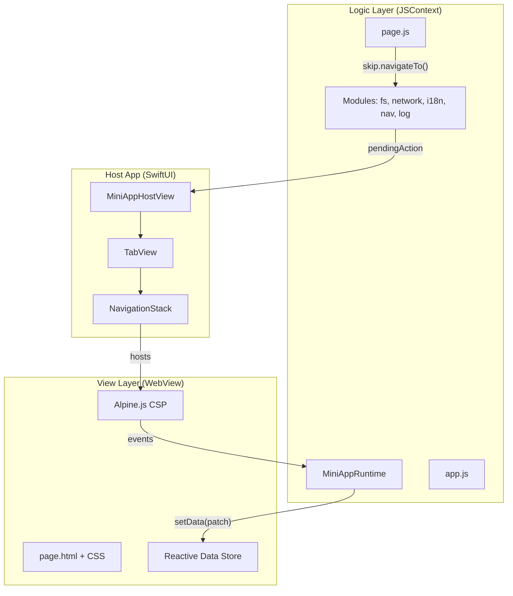
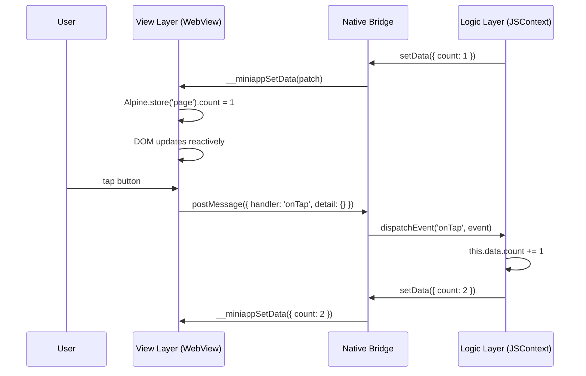
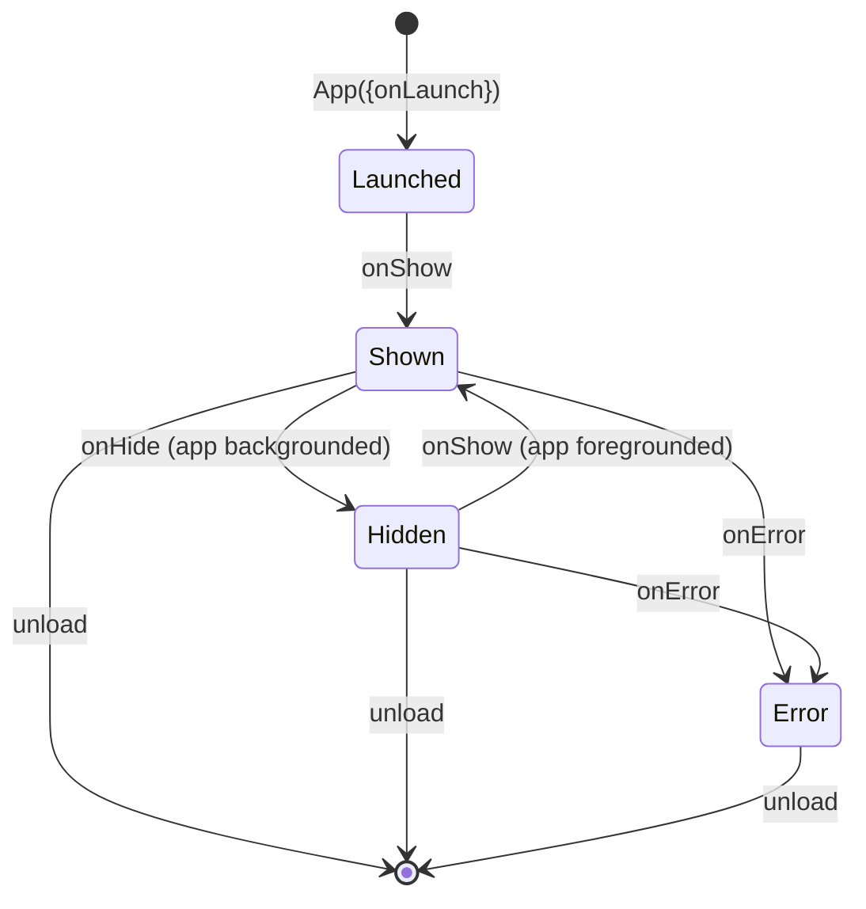
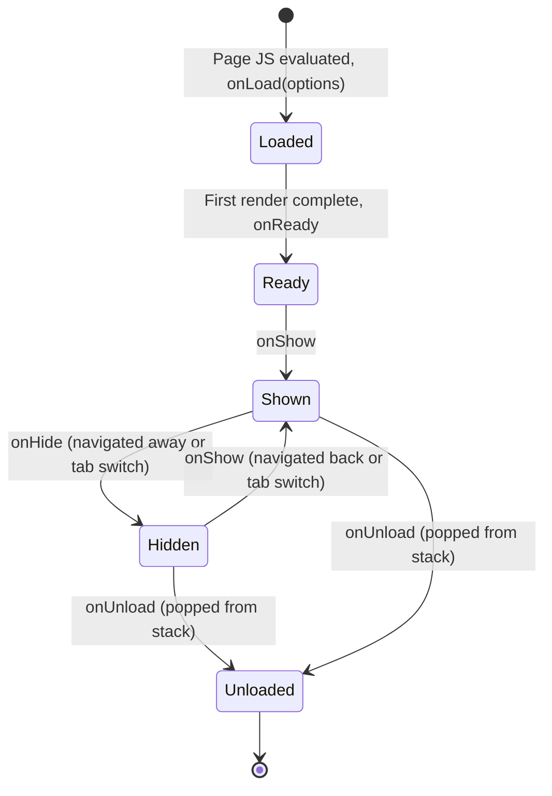

# SkipMiniApp

A [Skip](https://skip.dev) framework for loading and running [W3C MiniApp](https://www.w3.org/TR/miniapp-packaging/) packages on iOS and Android. Implements the dual-thread execution model (Logic Layer + View Layer), WeChat-compatible navigation APIs, and a reactive data-binding view system powered by Alpine.js.

> **Experimental**: This package is under active development. APIs may change without notice.

## Architecture Overview

SkipMiniApp follows the **dual-thread model** used by WeChat Mini Programs: application logic runs in an isolated JavaScript context (no DOM access), while the view layer renders HTML templates in a WebView (no host API access). Communication between the two threads flows through a structured bridge.



### Dual-Thread Model

The separation between Logic and View layers provides security isolation and performance predictability, matching the [W3C MiniApp Architecture](https://www.w3.org/TR/miniapp-manifest/#dfn-miniapp-user-agent) model:

| Layer | Runs In | Can Access | Cannot Access |
|-------|---------|-----------|---------------|
| **Logic Layer** | `JSContext` (JavaScriptCore) | Host APIs (`skip.fs`, `skip.fetch`, `skip.navigateTo`, etc.), page data via `this.data` and `this.setData()` | DOM, `document`, `window`, any HTML |
| **View Layer** | `WKWebView` (iOS) / `WebView` (Android) | Alpine.js reactive store, HTML templates, CSS, user event dispatch | Host APIs, file system, network, navigation |

**Data flows one way**: Logic → View via `setData()` patches. User interactions flow back as named events.



## W3C MiniApp Specifications

This framework implements portions of the following W3C specifications:

| Specification | Status | Coverage |
|--------------|--------|----------|
| [MiniApp Packaging](https://www.w3.org/TR/miniapp-packaging/#dfn-package-file) | Complete | ZIP-based `.ma` packages, resource layout, manifest location |
| [MiniApp Manifest](https://www.w3.org/TR/miniapp-manifest/#manifest-top-level-members) | Complete | All top-level members, window config, icons, permissions, widgets |
| [MiniApp Lifecycle](https://www.w3.org/TR/miniapp-lifecycle/#dfn-miniapp-global-lifecycle) | Complete | Global + per-page state machines, all lifecycle callbacks |
| [MiniApp Addressing](https://www.w3.org/TR/miniapp-addressing/#miniapp-uri-syntax) | Complete | `miniapp://` URI scheme with version, path, query, fragment |

## Package Structure

Following the [W3C MiniApp Packaging](https://www.w3.org/TR/miniapp-packaging/#dfn-package-structure) specification, a `.ma` package is a ZIP archive with this layout:

```
my-app.ma/
├── manifest.json          # App metadata (W3C MiniApp Manifest)
├── app.js                 # Logic Layer entry point (App lifecycle)
├── app.css                # Global styles
├── icons/                 # Tab bar and app icons (SVG)
│   ├── home.svg
│   ├── list.svg
│   └── profile.svg
├── pages/
│   ├── home/
│   │   ├── home.html      # View template (Alpine.js directives)
│   │   ├── home.js        # Page logic (Page lifecycle + handlers)
│   │   └── home.css       # Page styles
│   ├── detail/
│   │   ├── detail.html
│   │   ├── detail.js
│   │   └── detail.css
│   └── ...
└── i18n/                  # Internationalization
    ├── en.json
    ├── fr.json
    └── zh-CN.json
```

### Manifest (`manifest.json`)

Implements the [MiniApp Manifest specification](https://www.w3.org/TR/miniapp-manifest/#manifest-top-level-members):

```json
{
    "app_id": "com.example.myapp",
    "name": "My App",
    "short_name": "App",
    "description": "A sample MiniApp",
    "lang": "en",
    "icons": [{ "src": "icon.png", "sizes": "48x48" }],
    "version": { "code": 1, "name": "1.0.0" },
    "platform_version": { "min_code": 1 },
    "pages": [
        "pages/home/home",
        "pages/list/list",
        "pages/detail/detail"
    ],
    "window": {
        "navigation_bar_title_text": "My App",
        "background_color": "#ffffff",
        "navigation_style": "custom"
    },
    "tab_bar": {
        "tabs": [
            { "page": "pages/home/home", "text": "tab.home", "icon": "icons/home.svg" },
            { "page": "pages/list/list", "text": "tab.list", "icon": "icons/list.svg" }
        ]
    }
}
```

Key manifest members per the W3C spec:

| Member | Spec Reference | Description |
|--------|---------------|-------------|
| `app_id` | [appId](https://www.w3.org/TR/miniapp-manifest/#app_id-member) | Unique reverse-domain identifier |
| `name` | [name](https://www.w3.org/TR/miniapp-manifest/#name-member) | Full display name |
| `version` | [version](https://www.w3.org/TR/miniapp-manifest/#version-member) | Integer code + human-readable name |
| `pages` | [pages](https://www.w3.org/TR/miniapp-manifest/#pages-member) | Ordered list of page routes |
| `window` | [window](https://www.w3.org/TR/miniapp-manifest/#window-member) | Navigation bar, background, orientation |
| `icons` | [icons](https://www.w3.org/TR/miniapp-manifest/#icons-member) | App icons with sizes |
| `widgets` | [widgets](https://www.w3.org/TR/miniapp-manifest/#widgets-member) | Widget entry points |
| `req_permissions` | [reqPermissions](https://www.w3.org/TR/miniapp-manifest/#req_permissions-member) | Requested system permissions |
| `tab_bar` | WeChat extension | Tab bar configuration (2-5 tabs with SVG icons) |

## Lifecycle

### Global App Lifecycle

Implements the [W3C MiniApp Global Lifecycle](https://www.w3.org/TR/miniapp-lifecycle/#dfn-miniapp-global-lifecycle):



**Registration** (`app.js`):

```javascript
App({
    onLaunch: function(options) {
        // App initialized — options.path, options.query available
    },
    onShow: function() {
        // App became visible
    },
    onHide: function() {
        // App went to background
    },
    onError: function(message) {
        // Unhandled error
    }
});
```

### Page Lifecycle

Implements the [W3C MiniApp Page Lifecycle](https://www.w3.org/TR/miniapp-lifecycle/#dfn-miniapp-page-lifecycle):



**Registration** (`pages/home/home.js`):

```javascript
Page({
    data: {
        count: 0,
        items: []
    },

    onLoad: function(options) {
        // Page created — options.query available
        skip.setNavigationBarTitle({ title: 'nav.home' });
        this.setData({ count: 1 });
    },
    onShow: function() { /* Page became visible */ },
    onReady: function() { /* First render complete */ },
    onHide: function() { /* Page hidden (still in stack) */ },
    onUnload: function() { /* Page destroyed (popped) */ },

    // Custom event handlers (called from View Layer)
    onTapButton: function(event) {
        this.setData({ count: this.data.count + 1 });
    }
});
```

Each page in the navigation stack has its own WebView instance. When a page is popped, its WebView and all state are destroyed (matching WeChat behavior). Tab root pages persist across tab switches.

## Navigation

Five WeChat-compatible navigation APIs, plus `setNavigationBarTitle`:

| API | Behavior |
|-----|----------|
| `skip.navigateTo({ url, query })` | Push page onto current tab's stack (max 10 levels) |
| `skip.navigateBack({ delta })` | Pop `delta` pages (default 1, never pops root) |
| `skip.redirectTo({ url })` | Replace current page (no new stack entry) |
| `skip.reLaunch({ url })` | Clear all stacks, reset to single page |
| `skip.switchTab({ url })` | Switch to the tab whose root matches `url` |
| `skip.setNavigationBarTitle({ title })` | Set the navigation bar title (supports i18n keys) |

Navigation is managed by real SwiftUI `NavigationStack` (per-tab) with `TabView` when the manifest defines a `tab_bar`. Each pushed page gets its own isolated WebView.

## View Layer (Alpine.js)

Instead of WeChat's WXML templating language, pages use standard HTML with [Alpine.js](https://alpinejs.dev/) (CSP build) for reactive rendering:

```html
<body x-data="page">
    <h1 x-text="store.count"></h1>
    <button @click="onTapButton">Increment</button>

    <ul>
        <template x-for="item in store.items">
            <li x-text="item.name"></li>
        </template>
    </ul>

    <p x-text="$t('greeting.hello')"></p>
</body>
```

Available Alpine features:
- `x-data="page"` — connects to the page's reactive data store
- `x-text`, `x-show`, `x-if`, `x-for` — reactive rendering
- `@click="handlerName"` — dispatches events to the Logic Layer
- `x-model="store.key"` — two-way binding (syncs back to Logic Layer)
- `$t('key', params)` — i18n translation magic

## Modules

The runtime is extensible via `MiniAppModule`. Built-in modules:

| Module | Namespace | Description |
|--------|-----------|-------------|
| Navigation | `skip.navigateTo()` etc. | 5 WeChat navigation APIs + title |
| Network | `skip.fetch(url, options)` | Promise-based HTTP (GET/POST/PUT/DELETE) |
| File System | `skip.fs.root` | OPFS-style sandboxed storage (per-app isolation) |
| I18n | `skip.i18n.t(key)` | Translations, number/date formatting, plurals |
| Logging | `skip.log(...)` | Structured logging with host capture |

### File System API

```javascript
// Write a file
var dir = skip.fs.root.getDirectoryHandle('notes', { create: true });
var file = dir.getFileHandle('todo.txt', { create: true });
file.write('Buy groceries');

// Read it back
var content = file.read(); // "Buy groceries"

// List entries
var entries = skip.fs.root.entries(); // [{name, kind}]

// Remove
skip.fs.root.removeEntry('notes', { recursive: true });
```

### I18n API

```javascript
// Simple translation
var greeting = skip.i18n.t('hello.world');

// With parameters
var msg = skip.i18n.t('items.count', { count: 5 });
// Template: "You have {count} items" → "You have 5 items"

// Number formatting
var price = skip.i18n.n(1234.5, { style: 'currency', currency: 'USD' });

// Plural forms
var label = skip.i18n.plural(count, { one: '# item', other: '# items' });
```

Locale resolution chain: device locale → region default → language code → manifest `lang` → `"en"`.

## Modules

The package contains two Swift modules:

| Module | Role |
|--------|------|
| **SkipMiniAppModel** | Platform-independent: manifest parsing, package reading/building, JavaScript runtime, lifecycle state machines, all Logic Layer modules |
| **SkipMiniApp** | SwiftUI view layer: `MiniAppHostView`, `MiniAppPageView`, Alpine.js bridge, SVG icon rendering, WebView management |

## Usage

```swift
import SkipMiniApp

// Present a MiniApp in a full-screen cover
MiniAppHostView(
    directoryURL: miniAppURL,
    namespace: "skip",
    modules: [
        .fileSystem(baseDirectory: storageDir),
        .network,
        .i18n,
        .navigation,
        .logging(onLog: { entry in print(entry.message) })
    ],
    onDismiss: { dismiss() }
)
```

The `onDismiss` closure adds a close button (upper-right) to every page in the navigation stack.

## Building

```bash
swift build    # Swift compilation
swift test     # Swift tests + Kotlin transpilation + JVM tests
```

This project uses the [Skip](https://skip.dev) plugin to transpile Swift to Kotlin for Android. The `swift test` command verifies both platforms.

## License

This software is licensed under the [Mozilla Public License 2.0](https://www.mozilla.org/MPL/).
